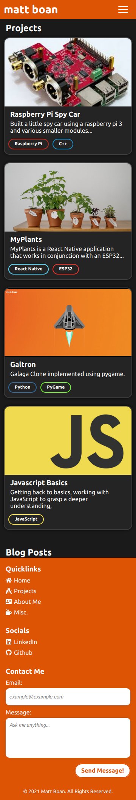

# MATT_BOAN

This website/blog/portfolio showcases all of my most interesting projects.

Hosted at: _Hosting coming soon_

## Dependencies

### Ubuntu/Debian

Install Node JS and npm:

```
sudo apt install nodejs
sudo apt install npm
```

Install dependencies for both the front end and back end:

```
cd front-end && sudo npm install
cd back-end sudo npm install
```

## Running the application

Running the back end:

```
cd back-end && npm start
```

Running the front end:

```
cd front-end && npm start
```

## Screenshot



